# AI Trading Agents - Architecture Diagram

Full-detail system diagram for the landing page. Layered top-to-bottom, narrow width.

**Layers**:
1. AI Trading Agents (clients)
2. Swiftward Gateways wall (INET / LLM / MCP)
3. Swiftward Server (vertical: Ingestion → Worker) **|** Trading Server (horizontal MCPs)
4. Exchanges & feeds **|** On-chain
5. Storage + Observability

## Full System Diagram

```mermaid
graph TB
    %% ══════════════════════════════════════════════════════
    %% LAYER 1 - AI Trading Agents
    %% ══════════════════════════════════════════════════════
    subgraph Agents["Pillar 1 - AI Trading Agents (isolated per container)"]
        direction LR
        GO_RANDOM["Go Random<br/>demo, no LLM"]
        GO_LLM["Go LLM<br/>OpenAI tool-calling"]
        CLAUDE_ALPHA["Claude Alpha<br/>Claude Code CLI<br/>Sonnet 4.6, 15min<br/>momentum trader"]
        CLAUDE_GAMMA["Claude Gamma<br/>Claude Code CLI<br/>Sonnet 4.6, 30min<br/>multi-agent debate"]
        PY_AGENT["Python Deterministic<br/>3-stage math brain<br/>4 loops"]
        RUBY_AGENT["Ruby Arena<br/>Solid Loop swarm<br/>6 strategies"]
        JAVA_AGENT["Java Gamma<br/>Spring Boot<br/>fear & greed contrarian"]
    end

    %% ══════════════════════════════════════════════════════
    %% LAYER 2 - Swiftward Gateway Wall (all agent traffic)
    %% ══════════════════════════════════════════════════════
    subgraph Gateways["Pillar 3 - Swiftward Gateway Wall (every agent request policy-evaluated)"]
        direction LR
        INET_GW["Internet Gateway :8097<br/>HTTP egress allowlist"]
        LLM_GW["LLM Gateway :8093<br/>OpenAI-compatible proxy<br/>prompt-injection scan<br/>end-of-session attestation"]
        MCP_GW["MCP Gateway :8095<br/>JSON-RPC proxy<br/>per-tool policy eval"]
    end

    %% ══════════════════════════════════════════════════════
    %% LAYER 3 - Swiftward Server | Trading Server (half-half)
    %% ══════════════════════════════════════════════════════
    subgraph Servers[" "]
        direction LR

        %% ── LEFT HALF: Swiftward Server (vertical pipeline) ──
        subgraph SwiftServer["Swiftward Server"]
            direction TB
            INGESTION["Ingestion :50051<br/>gRPC SyncEvaluate<br/>event intake,<br/>validation, routing"]
            QUEUE[("Queue<br/>Postgres inbox")]
            WORKER_WRAP["Worker<br/>Rules Engine (YAML DSL v2)<br/>+ UDFs (state, counters,<br/>dlp, classifier, regex)<br/>+ Actions (telegram, halt,<br/>http, hitl)"]
            DETECTORS["External Detectors<br/>PG2 + BERT (injection)<br/>Moderation LLM"]
            CONTROL["Control API + UI :5174<br/>rulesets, analytics,<br/>investigate events,<br/>attestation store"]

            INGESTION --> QUEUE
            INGESTION --> WORKER_WRAP
            QUEUE --> WORKER_WRAP
            WORKER_WRAP -.->|"HTTP UDFs"| DETECTORS
            CONTROL -.-> WORKER_WRAP
        end

        %% ── RIGHT HALF: Trading Server (horizontal MCPs) ─────
        subgraph TradingServer["Trading Server (single Go binary)"]
            direction TB

            subgraph TradingMCPs["MCPs (all in one binary)"]
                direction LR
                TRADING_MCP["<b>Trading MCP</b> ⭐<br/>submit_order, estimate,<br/>portfolio, history, limits,<br/>cancel, alerts<br/>+ EIP-712 signing<br/>+ keccak256 hash chain<br/>+ advisory lock"]
                MARKET_MCP["Market Data<br/>prices, candles,<br/>orderbook, funding,<br/>OI, indicators,<br/>Fear&Greed"]
                NEWS_MCP["News<br/>headlines,<br/>sentiment,<br/>event class,<br/>keyword alerts"]
                POLY_MCP["Polymarket<br/>CLOB,<br/>order search,<br/>prediction"]
                FILES_MCP["Files<br/>read, write,<br/>edit, append,<br/>list, find,<br/>search"]
                CODE_MCP["Code Sandbox<br/>Python exec,<br/>install,<br/>per-agent<br/>container"]
                RISK_MCP["Risk<br/>halt, resume,<br/>status<br/>(operator)"]
            end

            subgraph TradingExtras["Platform Services"]
                direction LR
                DASHBOARD["Dashboard<br/>:8091/dashboard<br/>agents, trades,<br/>evidence, alerts"]
                EVIDENCE_API["Evidence API :8092<br/>/v1/evidence/{hash}<br/>public, unauth"]
                ALERT_ENGINE["Alert Engine<br/>price + news triggers,<br/>OCO, trailing, soft stops"]
            end

            TRADING_MCP --> ALERT_ENGINE
            TRADING_MCP --> EVIDENCE_API
        end
    end

    %% ══════════════════════════════════════════════════════
    %% LAYER 4 - Exchanges | On-Chain
    %% ══════════════════════════════════════════════════════
    subgraph External[" "]
        direction LR

        subgraph Exchanges["Exchanges & Feeds"]
            direction LR
            KRAKEN_CLI_EXT["Kraken CLI<br/>per-agent creds"]
            KRAKEN_API["Kraken API<br/>spot + futures"]
            BYBIT["Bybit<br/>derivatives"]
            BINANCE["Binance<br/>spot + deriv"]
            PRISM["PRISM<br/>asset resolution"]
            CRYPTOPANIC["CryptoPanic<br/>news feed"]
            POLY_EXT["Polymarket<br/>CLOB API"]
        end

        subgraph OnChain["On-Chain (ERC-8004 + Hackathon)"]
            direction TB
            subgraph ERC8004["ERC-8004 Registries"]
                direction LR
                IDENTITY["Identity<br/>Agent NFT"]
                VALIDATION["Validation<br/>score 0-100"]
                REPUTATION["Reputation<br/>6 metrics"]
            end
            subgraph Hackathon["Hackathon Infra"]
                direction LR
                RISK_ROUTER["Risk Router<br/>EIP-712 verify,<br/>per-tx limits"]
                DEX["DEX<br/>match / fill"]
                VAULT["Capital Vault<br/>funded sub-accounts"]
            end
            VALIDATOR_CLI["Validator CLI<br/>erc8004-setup booster<br/>separate wallet"]
            RISK_ROUTER --> DEX
            RISK_ROUTER <-.-> VAULT
        end
    end

    %% ── LLM Providers (right of gateways, compact) ─────────
    subgraph LLMs["LLM Providers"]
        direction LR
        ANTHROPIC["Anthropic<br/>Claude"]
        OPENAI["OpenAI<br/>GPT"]
        LOCAL_LLM["Local<br/>Ollama/vLLM"]
    end

    %% ══════════════════════════════════════════════════════
    %% LAYER 5 - Storage + Observability + Operators
    %% ══════════════════════════════════════════════════════
    subgraph Bottom[" "]
        direction LR
        PG[("PostgreSQL<br/>trades, agent_state,<br/>decision_traces,<br/>rulesets, events,<br/>attestations")]
        SIGNOZ["SigNoz :3301<br/>OTLP traces,<br/>metrics, logs"]
        TELEGRAM["Telegram<br/>per-agent bot<br/>output + alerts"]
    end

    %% ── Operators ──────────────────────────────────────────
    TG_USER["Telegram Operator"]
    DASH_USER["Dashboard Operator"]
    POLICY_USER["Policy Author"]

    %% ══════════════════════════════════════════════════════
    %% CONNECTIONS
    %% ══════════════════════════════════════════════════════

    %% ── Operators ─────────────────────────────────────────
    TG_USER <-.-> TELEGRAM
    DASH_USER --> DASHBOARD
    POLICY_USER --> CONTROL

    %% ── Agents -> Gateway wall (ALL traffic) ───────────────
    Agents ==>|"HTTP egress"| INET_GW
    Agents ==>|"chat/completions"| LLM_GW
    Agents ==>|"tool calls"| MCP_GW
    Agents -.->|"output"| TELEGRAM

    %% ── Gateways -> Swiftward policy eval (gRPC) ───────────
    INET_GW --> INGESTION
    LLM_GW --> INGESTION
    MCP_GW --> INGESTION

    %% ── MCP Gateway also proxies approved calls to MCPs ────
    MCP_GW ==>|"approved proxy"| TradingMCPs

    %% ── LLM Gateway proxies approved to LLMs ───────────────
    LLM_GW -->|"approved proxy"| LLMs

    %% ── INET Gateway approved egress ───────────────────────
    INET_GW -.->|"approved egress"| Exchanges

    %% ── Swiftward Actions back to targets ──────────────────
    WORKER_WRAP -.->|"halt agent"| RISK_MCP
    WORKER_WRAP -.->|"alerts"| TELEGRAM
    LLM_GW -.->|"end-of-session<br/>attestation"| CONTROL

    %% ── Trading MCP callbacks to Swiftward for trade policy ─
    TRADING_MCP ==>|"trade_intent<br/>(enriched w/ portfolio)"| INGESTION

    %% ── Trading MCP -> exchanges ───────────────────────────
    TRADING_MCP --> KRAKEN_CLI_EXT
    TRADING_MCP --> KRAKEN_API
    TRADING_MCP --> BYBIT
    TRADING_MCP --> BINANCE

    %% ── Trading MCP -> on-chain (EIP-712 signed) ───────────
    TRADING_MCP ==>|"EIP-712 signed<br/>TradeIntent"| RISK_ROUTER

    %% ── Other MCPs -> sources ──────────────────────────────
    MARKET_MCP --> KRAKEN_API
    MARKET_MCP --> BYBIT
    MARKET_MCP --> BINANCE
    MARKET_MCP --> PRISM
    NEWS_MCP --> CRYPTOPANIC
    POLY_MCP --> POLY_EXT

    %% ── Evidence / reputation flow ─────────────────────────
    EVIDENCE_API -.-> VALIDATOR_CLI
    VALIDATOR_CLI --> VALIDATION
    VALIDATOR_CLI --> REPUTATION
    CLAUDE_ALPHA -.->|"registered once"| IDENTITY

    %% ── Storage ────────────────────────────────────────────
    TradingServer --> PG
    SwiftServer --> PG
    QUEUE --- PG

    %% ── Observability ──────────────────────────────────────
    Agents -.-> SIGNOZ
    TradingServer -.-> SIGNOZ
    SwiftServer -.-> SIGNOZ

    %% ══════════════════════════════════════════════════════
    %% STYLING
    %% ══════════════════════════════════════════════════════
    classDef agent fill:#50b356,stroke:#2d7a32,color:#fff
    classDef gateway fill:#9b59b6,stroke:#7d3c98,color:#fff
    classDef swiftcore fill:#8e44ad,stroke:#6c3483,color:#fff
    classDef swiftmgmt fill:#5b2c6f,stroke:#4a235a,color:#fff
    classDef mcp fill:#4a90d9,stroke:#2c5aa0,color:#fff
    classDef main fill:#1e40af,stroke:#172554,color:#fff,stroke-width:4px
    classDef infra fill:#5dade2,stroke:#2874a6,color:#fff
    classDef chain fill:#f39c12,stroke:#b9770e,color:#fff
    classDef hack fill:#e67e22,stroke:#a04000,color:#fff
    classDef ext fill:#7f8c8d,stroke:#566573,color:#fff
    classDef storage fill:#e8a838,stroke:#b07c1e,color:#fff
    classDef obs fill:#95a5a6,stroke:#7f8c8d,color:#fff
    classDef op fill:#34495e,stroke:#2c3e50,color:#fff

    class GO_RANDOM,GO_LLM,CLAUDE_ALPHA,CLAUDE_GAMMA,PY_AGENT,RUBY_AGENT,JAVA_AGENT agent
    class INET_GW,LLM_GW,MCP_GW gateway
    class INGESTION,QUEUE,WORKER_WRAP,DETECTORS swiftcore
    class CONTROL swiftmgmt
    class MARKET_MCP,NEWS_MCP,POLY_MCP,FILES_MCP,CODE_MCP,RISK_MCP mcp
    class TRADING_MCP main
    class DASHBOARD,EVIDENCE_API,ALERT_ENGINE infra
    class IDENTITY,VALIDATION,REPUTATION,VALIDATOR_CLI chain
    class RISK_ROUTER,VAULT,DEX hack
    class KRAKEN_CLI_EXT,KRAKEN_API,BYBIT,BINANCE,PRISM,CRYPTOPANIC,POLY_EXT,ANTHROPIC,OPENAI,LOCAL_LLM,TELEGRAM ext
    class PG storage
    class SIGNOZ obs
    class TG_USER,DASH_USER,POLICY_USER op
```



## Layer Breakdown

| Layer | Contents | Direction |
|-------|----------|-----------|
| **1. Agents** | 7 agents: Go Random, Go LLM, Claude Alpha/Gamma, Python, Ruby Arena, Java | LR (row) |
| **2. Gateway Wall** | INET :8097, LLM :8093, MCP :8095 - every agent request passes through | LR (row) |
| **3. Servers (split)** | **Left**: Swiftward Server (vertical: Ingestion → Queue → Worker → Control + Detectors). **Right**: Trading Server (MCPs row + platform services row). | LR, children TB |
| **4. External** | **Left**: Exchanges (Kraken CLI + API, Bybit, Binance, PRISM, CryptoPanic, Polymarket). **Right**: On-chain (ERC-8004 + Hackathon infra + Validator CLI). LLMs above as their own cluster. | LR |
| **5. Bottom** | PostgreSQL, SigNoz, Telegram | LR |

## How to Read It

**Every arrow from an agent passes through the gateway wall.** INET / LLM / MCP are the only exits from an agent container. All three call Swiftward Ingestion for policy evaluation before proxying to the real target.

**Trading MCP is the main hub** (thick dark-blue border). It:
- Signs EIP-712 TradeIntents
- Maintains the keccak256 decision hash chain
- Holds per-agent Kraken CLI credentials
- Executes on Kraken / Bybit / Binance
- Calls back into Swiftward (trade_intent events enriched with portfolio state) for trade-level policy eval
- Publishes decision traces to the Evidence API
- Posts signed intents to the Risk Router

**Swiftward pipeline is vertical** on the left half: Ingestion → Queue → Worker (Rules + UDFs + Actions) → (Detectors via HTTP UDFs). Control API + UI sits alongside Worker with its own rulesets + attestation store.

**Trading Server is horizontal** on the right half: 7 MCPs in one row, platform services (Dashboard, Evidence API, Alert Engine) in a second row.

## Key Data Flows

### 1. Trade Order (happy path)
```
Agent -> MCP Gateway (per-tool policy eval via Ingestion -> Worker)
  -> approved -> Trading MCP
  -> advisory lock + read state from PG
  -> enrich with portfolio context
  -> callback to Ingestion (trade_intent event)
  -> Worker rules verdict -> approved
  -> execute on Kraken/Bybit/Binance
  -> sign EIP-712 -> Risk Router -> DEX fill
  -> hash-chain decision trace -> PG
  -> return {status, decision_hash, prev_hash}
```

### 2. LLM Request
```
Agent -> LLM Gateway -> Ingestion -> Worker (PII, injection, DLP)
  -> approved -> proxy to Anthropic/OpenAI/local
  -> stream response through output rules (PII restore)
  -> end-of-session -> attestation stored in Control API
```

### 3. Halt by Operator
```
Dashboard Operator -> Dashboard -> Risk MCP -> PG (halted=true)
  -> next trade rejected before policy eval
  -> Swiftward Actions -> Telegram notification
```

### 4. Reputation Feedback
```
Validator CLI (separate wallet)
  -> fetch Evidence API
  -> re-execute trade
  -> post score -> Validation Registry
  -> giveFeedback() x6 -> Reputation Registry
```

## Verified Facts (from compose.yaml + Go code)

- 7 agents (Java is stub only, no compose service yet)
- Trading server: 7 MCPs in one binary + Dashboard + Evidence API + Alert Engine
- Swiftward gateways: 3 agent-facing (INET :8097, LLM :8093, MCP :8095) + internal gRPC ingestion :50051
- EIP-712 signing + hash chain are **inside** Trading MCP (`golang/internal/chain/`, `golang/internal/mcps/trading/service.go`)
- Observability: SigNoz (OTEL traces, metrics, logs via OTEL Collector → ClickHouse)
- Validator is a CLI tool (`cmd/erc8004-setup booster`), not a service
- Dashboard served by trading-server at `:8091/dashboard`; Swiftward Control UI separate at `:5174`
- Sandbox: one `sandbox-python` container per agent, spawned by Code MCP, bind-mounts `/data/workspace/{agent-id}`
